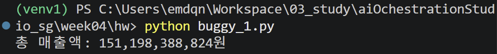
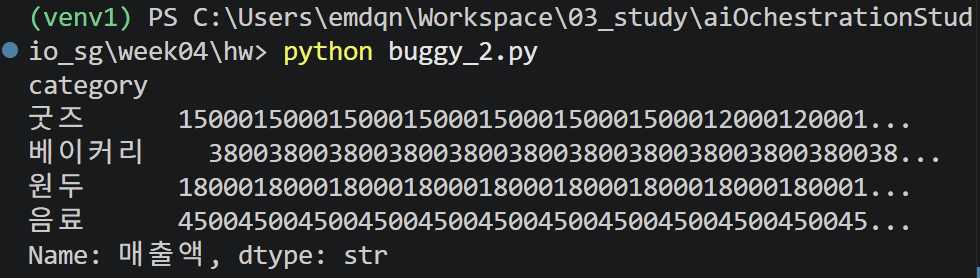
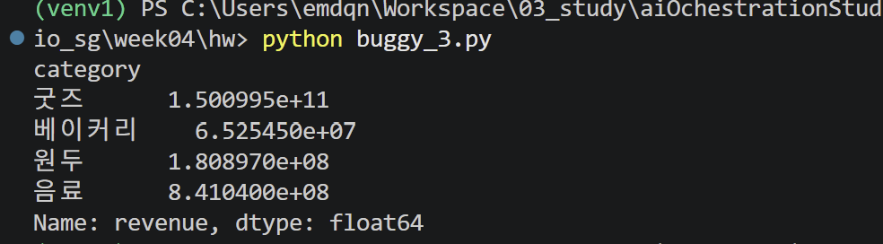
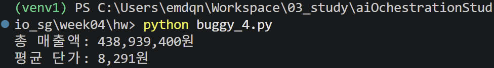
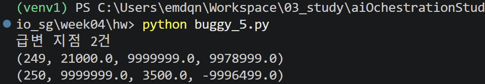

## 4주차 과제 진단 보고 및 AI 이용 내역
### 0. 활용한 AI 및 용도
- LLM(chatGPT) 사용
- 에러 로그에 대한 분석 요청
- 파악한 오류 원인 및 수정한 코드가 올바른지 질문
- 보고서 검증

---

### 1. buggy_1.py
### 1.1. 요약
- 핵심 오류 메시지: ValueError: invalid literal for int() with base 10: '5,200'
- 오류 발생 라인: price = int(row["price"])
- 오류 발생 이유: int()는 ','가 포함된 문자열을 숫자로 변환하지 못한다. 
    '원'이 포함된 문자열이 존재한다는 문제와 결측치가 존재한다는 문제도 같은 ValueError을 띄운다.
- 검증 결과

### 1.2. AI 이용 내역
- **입력 프롬프트**
    > (작성한 코드 첨부)  
        제가 수정한 코드를 설명해 주십시오.

- **답변 요지**
    - price가 빈 문자열인 경우 price = 0으로 처리하여 결측값으로 인해 int()에서 발생하는 오류를 방지하였다.
    - price에 포함된 ,와 원을 replace()로 제거한 후 int()로 변환하여 숫자로 계산할 수 있도록 하였다.

- **AI 답변에 대한 검증**
    - AI의 설명은 수정 의도를 잘 반영했고, 실제 코드의 동작과도 일치하였다.

---

### 2. buggy_2.py
- 핵심 오류 메시지: KeyError: '단가'
- 오류 발생 라인: df["매출액"] = df["단가"] * df["수량"]
- 오류 발생 이유: "단가", "수량"은 "dirty_sales.csv" 파일의 컬럼명과 일치하지 않는다.
- 검증 결과

- AI 미사용

---

### 3. buggy_3.py
- 핵심 오류 메시지: AttributeError: 'NoneType' object has no attribute 'groupby'
- 오류 발생 라인: result = df.groupby("category")["revenue"].sum()
- 오류 발생 이유: load_and_clean() 함수가 정제한 df를 반환하지 않아
    main()에서 반환값을 받은 df가 None이 되었고, None인 df에 groupby()를 호출하면서 문제가 발생하였다.
- 검증 결과

- AI 미사용

---

### 4. buggy_4.py
### 4.1. 요약
- 핵심 문제: 데이터에 결측치와 이상치가 존재하여, 구하고자 하는 총 매출액이 왜곡된다.
- 문제 파악 근거: describe()로 확인한 수치에 이상이 발견됐다.
    price의 최솟값이 음수이고 최댓값이 9999999이며, 
    quantity 역시 최댓값이 9999999로 나타나 정상적인 판매 데이터의 범위를 벗어난 것으로 보이는 극단값이 존재한다.
    최대, 최소 쪽의 실제 행을 확인해 본 결과 역시 입력 오류 내지는 통계적으로 의미 없는 값으로 추측됐다.
    revenue는 price x quantity로 계산되므로 이러한 이상치가 총 매출액을 크게 왜곡할 위험이 있다.
### 4.2. AI 이용 내역
- **입력 프롬프트**
    >  총 매출액 집계 스크립트입니다. 아래는 작성된 함수와 해당 함수의 실행 결과 출력입니다. 에러는 발생하지 않으나, 우려되는 점은 describe 함수를 사용하여 데이터의 분포를 확인했을 때, 최솟값은 음수이며 최댓값은 지나치게 큰 것으로 확인됩니다. info 함수로 확인한 price 열의 결측치는 두 개이며, quantity 열의 결측치는 없어 이는 크게 문제가 되지 않으나, 상기한 이상치로 인해 최종 출력인 총 매출액과 평균 단가가 올바르지 않은 값이 된다고 생각됩니다.  
        1. 제 추측이 맞는지 확인해 주시고  
        2. 데이터 전처리를 어떻게 함으로써 이 문제를 해결할 수 있을지 제안해 주십시오.  

    > 첨부한 기존 코드는 다음과 같다.     
    def main():  
    df = pd.read_csv("dirty_sales.csv", encoding="utf-8")  
        # price를 숫자로 바꾼다 (빈 값은 NaN이 된다 — 그런데 그 규모를 확인하지 않았다)  
        df["price"] = (df["price"].astype(str)
                                  .str.replace(",", "")
                                  .str.replace("원", "")
                                  .str.strip())  
        df["price"] = pd.to_numeric(df["price"], errors="coerce")  
        # 매출액 = 단가 x 수량 (NaN이 섞이면 그 행의 매출액도 NaN)  
        df["revenue"] = df["price"] * df["quantity"]  
        # 정보 확인   
        df.info()  
        print(df.describe())  
        # sum()은 NaN을 조용히 건너뛰고, 음수/극단값은 그대로 더한다  
        total = df["revenue"].sum()  
        avg_price = df["price"].mean()  
        print(f"총 매출액: {total:,.0f}원")  
        print(f"평균 단가: {avg_price:,.0f}원")
    
    > 첨부한 전처리 전 결과는 다음과 같다.  
    <class 'pandas.DataFrame'>  
        RangeIndex: 500 entries, 0 to 499  
        Data columns (total 7 columns):  
        #   Column    Non-Null Count  Dtype  
        ---  ------    --------------  -----  
        0   date      500 non-null    str    
        1   product   500 non-null    str    
        2   category  490 non-null    str    
        3   price     498 non-null    float64
        4   quantity  500 non-null    int64  
        5   stock     485 non-null    float64
        6   revenue   498 non-null    float64
        dtypes: float64(3), int64(1), str(3)  
        memory usage: 27.5 KB  
    
    >    price      quantity       stock       revenue  
            count  4.980000e+02  5.000000e+02  485.000000  4.980000e+02  
            mean   2.834237e+04  2.010569e+04  249.995876  3.036112e+08  
            std    4.477810e+05  4.472088e+05  141.211450  6.721638e+09  
            min   -4.500000e+03  1.000000e+00    1.000000 -5.355000e+05  
            25%    3.800000e+03  5.375000e+01  128.000000  2.789250e+05  
            50%    5.000000e+03  1.120000e+02  250.000000  5.787500e+05  
            75%    1.200000e+04  1.610000e+02  363.000000  9.833750e+05  
            max    9.999999e+06  9.999999e+06  500.000000  1.500000e+11  
        
    > 총 매출액: 151,198,388,824원  
    평균 단가: 28,342원

- **답변 요지**
    - 현재 데이터에는 결측치와 음수 및 극단적으로 큰 값이 존재하므로, 이를 그대로 집계할 경우 총 매출액과 평균 단가가 왜곡될 가능성이 있다.
    - 이상치가 결과에 영향을 줄 수 있다고 판단한 근거
        - price와 quantity에서 평균과 중앙값의 차이가 크게 나타나며, 이는 극단값이 평균을 크게 끌어올리고 있을 가능성을 보여준다.
        - revenue = price x quantity이므로, price와 quantity에 극단값이 존재할 경우 매출액 역시 비정상적으로 크게 계산될 수 있다.
    - 전처리 방법
        - 먼저 이상값이 포함된 행을 확인한 후, 실제 상품 가격 및 판매량의 정상적인 범위나 업무 규칙을 기준으로 이상치 판단 기준을 정하는 것이 적절하다.
        - price의 결측치는 매출 집계에서 임의로 0으로 처리하면 실제 매출을 0원으로 간주하게 되므로, dropna()를 사용하여 제외하거나 원본 데이터를 확인하여 적절한 값으로 보완하는 방법을 고려할 수 있다.
        - 음수 및 지나치게 큰 price, quantity 값은 실제 데이터 오류인지 확인한 후, 오류로 판단되는 경우 해당 행을 제외하는 방식으로 전처리할 수 있다.

- **채택/기각 판단**
    - price의 결측값은 임의로 0으로 처리하면 매출액이 0원으로 계산될 수 있으므로, 결측 행을 제외하라는 제안을 채택하여 dropna(subset=["price"])를 사용하였다.
    - 실제 데이터를 확인한 결과 음수와 이상치는 통계적으로 의미 없는 값으로 보였으므로, 이상치를 제거해야 한다는 AI의 답변을 채택하였다. AI가 제시한 기준값이 명백하게 비정상적인 값을 제거하기 충분하였으므로 해당 기준 역시 채택하였다.

- **검증 결과**
    - 전처리 코드를 실행한 후 df.info()와 df.describe()를 다시 확인하고, 총 매출액과 평균 단가를 전처리 전 결과와 비교하였다.
    - 아래 출력을 분석해 보면, price의 최댓값이 9,999,999원에서 21,000원으로 감소하였으며, 평균도 28,342원에서 8,291원으로 감소하였다. 반면 중앙값은 5,000원으로 동일하게 유지되었다. 이를 통해 전처리 전에 존재하던 극단적인 가격값이 평균을 크게 높이고 있었음을 확인하였다. 따라서 이상치 제거가 가격 통계에 미치는 영향을 확인할 수 있었으며, 설정한 전처리 기준이 데이터 정제에 적절하게 적용되었음을 검증하였다.
    
    > <class 'pandas.DataFrame'>  
    Index: 495 entries, 0 to 499  
    Data columns (total 7 columns):  
        #   Column    Non-Null Count  Dtype  
        ---  ------    --------------  -----  
        0   date      495 non-null    str    
        1   product   495 non-null    str    
        2   category  485 non-null    str      
        3   price     495 non-null    float64  
        4   quantity  495 non-null    int64    
        5   stock     480 non-null    float64  
        6   revenue   495 non-null    float64  
        dtypes: float64(3), int64(1), str(3)  
        memory usage: 30.9 KB  
    
    >   price    quantity       stock       revenue  
        count    495.000000  495.000000  480.000000  4.950000e+02  
        mean    8290.909091  105.828283  251.504167  8.867463e+05  
        std     6068.413791   59.631262  141.153568  9.304293e+05  
        min     2800.000000    1.000000    1.000000  2.800000e+03  
        25%     3800.000000   53.000000  129.750000  2.804500e+05  
        50%     5000.000000  112.000000  252.500000  5.775000e+05  
        75%    12000.000000  160.500000  364.250000  9.750000e+05  
        max    21000.000000  200.000000  500.000000  4.200000e+06

    > 총 매출액: 438,939,400원  
        평균 단가: 8,291원

---

### 5. buggy_5.py
### 5.1. 요약
- 핵심 오류 메시지: IndexError: list index out of range
- 오류 발생 라인: diff = prices[i + 1] - prices[i]
- 오류 발생 이유: 기존 작성한 코드에서 i의 최댓값은 곧 접근 가능한 인덱스 최댓값이었는데, 반복문 내부에서 i+1을 사용함으로써 접근 가능한 범위를 초과하였다.

### 5.2. AI 이용 내역
- **입력 프롬프트**
    > 정제한 price를 앞뒤로 비교하여 급변 지점을 찾는 스크립트입니다. 그런데 아래 함수의 반복문이 끝까지 가지 못하고 중간에 다음과 같은 오류 메시지를 띄웁니다. 디버거로 확인해 보니, i=499일 때 오류가 납니다. len(prices)로 접근하여 i의 최댓값이 곧 접근할 수 있는 인덱스 최댓값이나, 반복문 안에서 i+1을 사용함으로써 접근 가능한 범위를 벗어난 것 같습니다.   
        1. 제 추측이 맞는지 알려주십시오.   
        2. i가 접근 가능한 범위를 range(len(prices)-1)로 접근하면 문제가 해결되지 않을까 싶은데, 더 나은 방법이 있다면 알려주십시오.

    > 첨부한 기존 코드는 다음과 같다.  
    def find_big_jumps(prices, threshold=100000):  
        jumps = []  
        for i in range(len(prices)):  
            diff = prices[i + 1] - prices[i]      # <-- 여기가 문제의 줄  
            if abs(diff) >= threshold:  
                jumps.append((i, prices[i], prices[i + 1], diff))  
        return jumps
    
    > 첨부한 에러 로그는 다음과 같다.  
    Traceback (most recent call last):  
    File "C:\Users\emdqn\Workspace\03_study\aiOchestrationStudio_sg\week04\hw\buggy_5.py", line 43, in <module>  
    jumps = find_big_jumps(prices)  
    File "C:\Users\emdqn\Workspace\03_study\aiOchestrationStudio_sg\week04\hw\buggy_5.py", line 36, in find_big_jumps  
        diff = prices[i + 1] - prices[i]      # <-- 여기가 문제의줄  
               ~~~~~~^^^^^^^  
    IndexError: list index out of range

- **답변 요지**
    - prices의 길이가 500이면 유효한 인덱스는 0~499이다. 기존 반복문은 range(len(prices))를 사용하여 i=499까지 반복하는데, 반복문 내부에서 prices[i+1]을 사용하므로 i=499일 때 prices[500]에 접근하게 되어 IndexError가 발생한다.
    - i와 i+1을 비교하는 코드이므로 마지막 원소에서는 비교할 다음 원소가 존재하지 않는다. 
    - 따라서 반복 범위를 range(len(prices)-1)로 수정하면 마지막 반복에서 범위를 벗어나는 문제를 해결할 수 있다.

- **채택/기각 판단**
    - 디버거를 통해 i=499에서 오류가 발생하는 것을 확인하였기에, prices[i+1]이 prices[500]에 접근하는 문제라는 설명이 오류 상황과 일치한다고 판단하여 원인 분석을 채택하였다.
    - len(prices)-1로 수정하는 것이 가장 간결하고, '다음 원소와 비교하는 반복문이므로 마지막 원소는 반복 대상에서 제외한다'는 의도가 잘 드러나는 코드라는 의견을 채택하였다.

- **검증 결과**
    - IndexError 발생 없이 반복문이 끝까지 정상적으로 실행되었다.
    - i의 최댓값이 498이 되었고, 마지막 반복에서 prices[498]과 prices[499]를 비교하게 되어 유효한 인덱스 범위 내에서 실행되는 것을 확인하였다.
    

---

### 6. 이외 질문 및 요청 사항
### 6.1. 디버거 실행 시 파일을 찾지 못하는 오류 원인 확인 및 해결
- **질문 배경**
    - buggy_5.py 파일의 에러 원인을 원활히 확인하기 위해 파이썬 디버거를 실행시켰는데, dirty_sales.csv 파일을 찾지 못한다는 에러가 발생하였다.
    - buggy_5.py 파일이 존재하는 디렉터리 안에 해당 파일이 함께 존재했으며, 터미널에서 실행할 때는 발생하지 않았던 에러였다. 이에 디버거에서만 문제가 발생한 원인과 그 해결 방법을 알고자 하였다.

- **AI 답변 및 적용 내용**
    - 해당 오류는 디버거가 실행할 때의 현재 작업 디렉터리가 터미널에서 실행할 때와 달라 생기는 경우가 많다.
    - 실제로 `print(os.getcwd())`를 작성하고 디버거로 실행하여 확인한 결과, 터미널의 경로와 다르게 나왔다.
    - 이에 디버거로 실행할 때는 코드의 파일 경로를 수정하여 올바른 위치에서 파일을 찾을 수 있게 하였다.

### 6.2. 보고서 개선
### 6.3. 커밋 메시지 추천